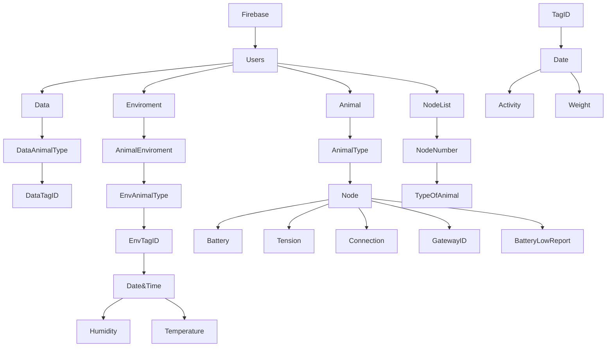

Here is a simple flow chart of the firebase with the data trasnmitted:

```mermaid
graph TD;
    Firebase--> Users;
    Users-->Data;
    Users-->Enviroment;
    Users-->Animal;
    Users-->NodeList;
    Data-->DataAnimalType;
    DataAnimalType-->DataTagID;
    TagID-->Date;
    Date--> Activity;
    Date-->Weight;
    Enviroment-->AnimalEnviroment;
    AnimalEnviroment--> EnvAnimalType;
    EnvAnimalType--> EnvTagID;
    EnvTagID --> Date&Time;
     Date&Time --> Humidity;
      Date&Time-->Temperature;
      Animal--> AnimalType;
      AnimalType-->Node;
      Node-->Battery;
      Node-->Tension;
      Node-->Connection;
      Node-->GatewayID;
      Node-->BatteryLowReport;
      NodeList-->NodeNumber;
      NodeNumber-->TypeOfAnimal;
      
    

    
```
